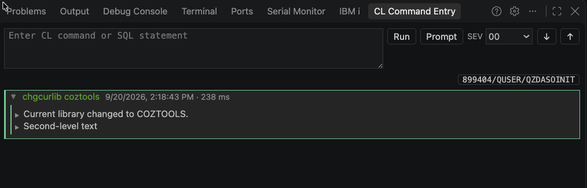
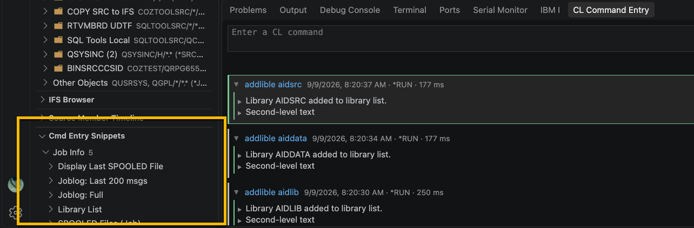

# CL Prompter and Formatter — Professional IBM i CL Tools for VS Code

A professional CL (Control Language) prompter and formatter for VS Code that brings the familiar IBM i F4 CL prompter experience, intelligent code formatting, and a dedicated CL Command Entry workspace to your modern IBM i development environment. Works seamlessly with the vscode-for-ibmi extension (Code4IBMi).

## Available on

- [VS CODE Marketplace](https://marketplace.visualstudio.com/items?itemName=CozziResearch.clprompter)
- [Open VSX marketplace](https://open-vsx.org/extension/CozziResearch/clprompter)

## Overview

This extension provides three complementary capabilities for IBM i CL development:

**CL Prompting** — A fully functional IBM i command prompter that interprets IBM i `*CMD` objects directly, supporting both IBM-supplied and user-defined commands with complete prompting accuracy. Nested prompting, parameter validation, and command definition handling are preserved, allowing developers to interact with the IBM i command model from VS Code.

**CL Formatting** — Professional formatting for CL source, with support for individual statements or entire files. The formatter understands CL syntax, preserves comments, properly handles qualified names, and respects your formatting preferences.

**CL Command Entry** — A dedicated VS Code side-panel workspace for entering and running non-interactive IBM i CL commands such as `CPYF` and `CHGJOB`, with CL Prompting support and detailed message output from the command's execution. In addition, SQL statements may be run using the `SQL:` prefix, for example: `SQL: update orders set cost = 1.00 where ITMNBR = 'A3742'`

**CL Syntax Checking** — Full CL syntax checking was originally created for this extension; it has now been merged with the **IBM** `vscode-clle` extension, where it is shipped and installed. It is no longer provided by this extension.

Together, these capabilities allow developers to work with CL commands and source code outside of the traditional green-screen experience—without sacrificing fidelity, behavior, or control. The extension also exposes a callable API, making it suitable for automation, extension integration, and AI-assisted workflows.

## Getting Started

When the extension is first activated, it checks your IBM i host for the SQL UDTFs it requires. For each function, the extension only uploads and installs when needed:

- The function is not currently installed on the host.
- The function is installed, but the version shipped with this extension is newer than the version on the host.
- **You must have the IBM i C/C++ Compilers installed** in order for these functions to be uploaded and compiled or they will not install on your IBM i host.

The extension currently manages these SQL UDTFs (this list may grow over time):

- **CMD_HELP**: Used by CL Prompter (and eventually the main CL extension) to display command and parameter help text.
- **CMD_XML**: Used by CL Prompter to retrieve `*CMD` object parameter definitions in XML format, which are used to construct the CL Prompter panel.
- **CMD_RUN**: Used by CL Command Entry to process user-specified CL commands on the IBM i host server.

### CL Prompting

To prompt a CL command:

1. Open a CLP, CLLE, CMD, or BND source member.
2. Place your cursor on the line with the command you want to prompt.
3. Press **F4** or use the context menu right-click -> "CL Prompter" to prompt.
4. Fill in the parameters in the prompter.
5. Press **Enter** to update your code or **F3/Cancel** to cancel (the `ESC` key also cancels).
6. Your command is automatically formatted according to your preferences—just like the IBM i prompter.

### CL Formatting

To format your CL code:

- **Format single statement**: Place your cursor on a CL command line and use the command palette -> "Format CL (current line)"
- **Format entire file**: Use the command palette -> "Format CL (file)" or right-click in the editor and select "Format CL (file)"

The formatter intelligently handles CL syntax, preserves trailing comments, and respects your formatting preferences for indentation, keyword positioning, and line wrapping.

## CL Command Entry Panel

The CL Command Entry panel provides a dedicated command-entry workspace in the VS Code side panel for running and prompting IBM i CL commands without leaving your editor context. The CL Command Entry panel will appear after you connect to an IBM i server or on demand depending on your `settings`.

The `CL Command Entry Panel` is intended for **non-interactive CL commands** such as `CPYF`, `CHGJOB`, and similar commands that can execute without a green-screen display.

### Command Entry Features

- **Run commands** — Enter a CL command and run it directly from the panel.
- **Prompt commands** — Use **F4** or **Prompt** to open CL Prompting for the current command text, then return the prompted command to the input field. Command parameter help is available inside the prompter, just like the 5250 prompter.
- **Run modes** — Choose `*RUN` (normal) or `*LIMIT` (limited user) before execution.
- **Message detail output** — A message log (similar to a joblog) is rendered for each CL command you run.
- **Execution feedback** — See elapsed time and final outcome for each command (`success`, `warning`, `error`).
- **History and recall** — Reuse previously entered commands across sessions; use `ArrowUp`/`ArrowDown` or function keys (`F9=Prior`, `F8=Next`, `F10=Expand/Collapse messages`). You can also bring up a list of previously run CL commands and select a command from it.
- **Code Snippets button** — A dedicated `Code Snippets` button `{ }` opens a list of reusable Code Snippets. Code Snippets can be CL commands or SQL statements.
- **Panel visibility control** — `Command Entry` visibility can be on demand, at start up, or after a connection. For on-demand visibility, use either of the following new VSCODE commands (Cmd+Shift+P/Ctrl+Shift+P):
  - **CLPROMPTER: Open CL Command Entry**
  - **CLPROMPTER: Close CL Command Entry**
- **Flexible menu launch on `...`** — The Command Entry menu opens with click (or right-click) on the `...` toolbar button.

### Private SQL Job Reconnect (Optional)

If you use private Command Entry job mode, these settings and steps ensure your IBM i job environment is reset correctly:

1. In Code for IBM i connection settings, under **HTTP Server* enable the `mapepireUseServer=true` (Connect to remote Mapepire Server) option.
2. Connect to IBM i and open Command Entry.
3. Open the Command Entry `...` button to expose the options menu and choose one of these options:
  - **Use Shared SQL Job**
  - **Use Private SQL Job**
4. Your choice is saved in that IBM i connection's settings and is reused the next time you connect to the same host/connection.
5. CLPROMPTER performs a one-time startup reconnect cycle for private SQL job mode in server mode so stale job environment settings (for example prior library-list changes) are not carried over between VS Code sessions.
6. Any time you need a clean up/reset your private SQL job, use Command Entry menu `...` -> `Reconnect Server Job`.

Important behavior:

- Shared/Private switching is only available when Mapepire Server Mode is enabled.
- If Mapepire Server Mode is not enabled, CLPROMPTER uses the shared SQL job even if private mode was previously selected.

Notes:

- On IBM i disconnect, CLPROMPTER now closes its private SQL job/session state.
- On VS Code extension deactivation, CLPROMPTER performs private job cleanup again as a safety net.

### Limitations and Behavior Notes

- **Interactive CL commands are not supported in the Command Entry panel** — Commands like `WRKOBJ`, `WRKACTJOB`, and `DSPLIBL OUTPUT(*)` do not display the 5250 style interactive UI and therefore are not support. Unpredictable results may occur.
- **Cancel Request is disabled in Shared Job mode** — The cancel action feature is implemented when the Shared CODE for IBM i SQL job is used. In private SQL Job mode, the cancel request is attempted to cancel a long-running SQL statement but is not guaranteed to cancel the request.
- **Prompt does not auto-run** — After prompting a CL command, the command string is returned to the input command line but not automatically run. To run the command, press `Enter` or the **Run** button. Note that this is purposely different from the classic IBM i 52520 Command Entry screen's behavior.
- **SQL fetch window is configurable** — CL Command Entry SQL statements (`sql: ...`) use these settings:
  - `clPrompter.cmdEntryLimitSqlFetch` controls whether SQL rows are loaded incrementally.
  - `clPrompter.cmdEntrySqlFetchRowLimit` sets the maximum rows per fetch (for example `1000` or `2000`) for manual **Load more rows** requests.
  - `clPrompter.cmdEntrySqlFirstPageRowsToFetch` is the first-page row count (default `200`) used only when the SQL statement is first run.
  - After the first page, manual **Load more rows** uses `clPrompter.cmdEntrySqlFetchRowLimit`.
  - When incremental loading is disabled (`false`), behavior is equivalent to `*NOMAX` (fetch all available rows on run).
  - private-job mode (when `clPrompter.cmdEntryUseSharedSQLJob=false`) still uses backend sub-fetches as needed, and the SQL Results panel appends rows dynamically.
  - If `SQL:` is omitted, statements beginning with `SELECT` or `VALUES` are automatically treated as SQL.
- **Code Snippet templating** — Code Snippets support runtime substitution variables:
  - `${sqlJobId}` (`nnnnnn/user/job`)
  - `${sqlJobName}` (`job` only)
  - `${sqlJobNumber}` (`nnnnnn` only)
  - `${currentUser}`
  - `${currentLibrary}`
- **Code Snippet management UI** — From Code Snippets menu choose **Add more...** or **Manage Code Snippets...** to open the editor for Add/Edit/Delete/Reorder of user Code Snippets. Built-in Code Snippets are read-only.
- **Code Snippet sharing** — Use these commands from Command Palette:
  - `CLPROMPTER: Export Code Snippets`
  - `CLPROMPTER: Import Code Snippets`
  - Import options are `Merge`, `Replace All`, and `Add New Only`.
- **Optional startup history clear** — Set `clPrompter.cmdEntryClearHistoryOnStartup=true` to clear Command Entry command history and message log when CLPROMPTER starts.

#### Command Entry Code Snippets

Included with Command Entry is an executable Code Snippet view that allows you to do typical Command Entry stuff, such as view your library list, look at the last SPOOLED file you created, view your joblog, etc. It is located on the right tree view panel below your CODE for IBM i Filters. The shipped features will likely be refined and updated over the coming months as more usage is logged. Adding user-written code snippets is planned for an upcoming release.

## CL Prompter Features

- **Visual Focus Indicator** — Clear arrow (▶) indicator shows which input field currently has focus, making it easy to navigate through complex command parameters.
- **Tab Navigation** — Press TAB to move seamlessly between input fields, just like traditional 5250 prompting.
- **Comment Preservation** — Trailing comments on your CL commands are automatically preserved and properly formatted when you submit the prompter.
- **Help Text** - Simlar to the 5250 CL promtper, CL Command Help is provided for each parameter. Look for the `?` near the parameter to call up that parameters online helptext. The helptext engine used by CL Prompter is must more efficient that other interfaces CL helptext so there is little to no lag between requesting the Helptext and viewing it.
- **F3=Exit** — Press `F3` during prompting to cancel and return to your code without changes. Users may also use the `ESC` key instead of `F3`.
- **Enter=Apply** — Press Enter during a prompter to returns the completed CL command string to the editor.
- **F12=Cancel** - Press `F12` during prompter to cancel the prompter and return the current Command string, including any invalid parameter values, to the editor.
- **Focus based validation** - Each parameter's restrictions are validated when you attempt to move the cursor out of the parameter's input field. A message is immediately displayed near the parameter. Resolve the issue before continuing, or press F3 to return without fixing the issue.

### CL Formatter Features

- **Automatic Formatting on Return from Prompting** — When you press Enter to apply changes from the prompter, your CL command is automatically reformatted to match your preferences, just like the IBM i prompter.
- **Single Statement or Whole File** — Format a single CL command or an entire source file.
- **Intelligent Keyword Alignment** — Configurable keyword and continuation indentation keep CL source consistent and readable.
- **ELEM Parameter Handling** — Complex ELEM parameters such as `CHGJOB`'s `LOG` parameter stay grouped on a single line when possible.
- **Comment Preservation** — Trailing comments are kept intact and wrapped cleanly across continuation lines.
- **Qualified Name Formatting** — Properly formatted qualified object names, such as `QIWS/QCUSTCDT` are supported.
- **Multi-line Formatting** — Long commands are wrapped onto multiple lines with proper indentation.
- **Case Conversion** — Configurable command name, keyword name and parameter values can be automatically converted to uppercase, lowercase, or kept in their original format.

### Customization & Configuration

- **Theme-Aware Colors** — Keyword and value colors automatically adapt to your VS Code theme (light/dark/high-contrast) or use your custom colors for the prompter.
- **Configurable Formatting** — Control label position, command position, keyword position, continuation position, and right margin for both prompter output and formatter.
- **Case Conversion** — Choose between uppercase, lowercase, or no case conversion for your CL code (applies to both prompter and formatter).
- **Custom Color Settings** — Set your preferred colors for keywords and values in the prompter with optional automatic theme adjustment.
- **Command Entry Startup Visibility** — Enable or disable **Show Command Entry in Panel at Startup** to control whether the CL Command Entry panel appears automatically when the extension starts.
- **Open/Close Command Entry Commands** — Use **CLPROMPTER: Open CL Command Entry** and **CLPROMPTER: Close CL Command Entry** from the Command Palette to explicitly show or hide the CL Command Entry panel.

### Diagnostic Tools (for interal use and troubleshooting)

- **Save Command XML** — Optionally save the IBM i command definition XML to a file for analysis.
- **Save Prompter HTML** — Optionally save the generated prompter HTML for diagnostic purposes when reporting issues.
- **Save Command Helptext** — Optionally save the command parameter helptext HTML generated from the `?` button for diagnostic analysis.

For all three save-location settings, enter `${tmpdir}`, `${userHome}`, `${workspaceFolder}`, or any absolute path.

## Links

- [Source Code](https://github.com/bobcozzi/clPrompter)
- [Issues](https://github.com/bobcozzi/clPrompter/issues)

## Contributing

Contributions are welcome! To contribute:

1. Fork this repository and clone it locally.
2. Create a new branch for your feature or bugfix.
3. Make your changes, then commit and push to your branch.
4. Open a [pull request](https://github.com/bobcozzi/clPrompter/pulls) describing your changes.

For bug reports or feature requests, please open an issue on the [Issues](https://github.com/bobcozzi/clPrompter/issues) page.

If you are unsure or have questions, feel free to start a discussion or reach out via issues.

Thanks for your interest in improving CL Prompter and Formatter!

-Bob
