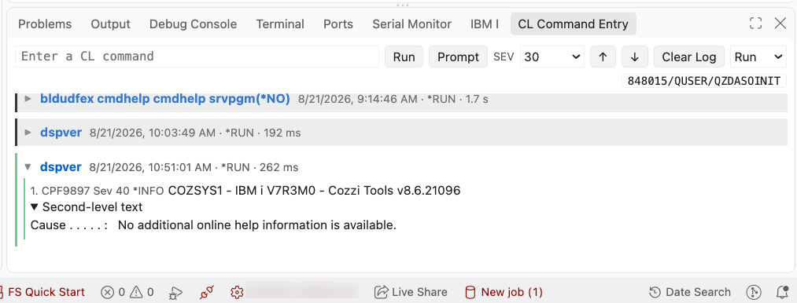

# CL Prompter and Formatter — Professional IBM i CL Tools for VS Code

A professional CL (Control Language) prompter and formatter for VS Code that brings the familiar IBM i F4 CL prompter experience, intelligent code formatting, and a dedicated CL Command Entry workspace to your modern IBM i development environment. Works seamlessly with the vscode-for-ibmi extension (Code4IBMi).

## Available on

- [VS CODE Marketplace](https://marketplace.visualstudio.com/items?itemName=CozziResearch.clprompter)
- [Open VSX marketplace](https://open-vsx.org/extension/CozziResearch/clprompter)

## Overview

This extension provides three complementary capabilities for IBM i CL development:

**CL Prompting** — A fully functional IBM i command prompter that interprets IBM i `*CMD` objects directly, supporting both IBM-supplied and user-defined commands with complete prompting accuracy. Nested prompting, parameter validation, and command definition handling are preserved, allowing developers to interact with the IBM i command model from VS Code.

**CL Formatting** — Professional formatting for CL source, with support for individual statements or entire files. The formatter understands CL syntax, preserves comments, properly handles qualified names, and respects your formatting preferences.

**CL Command Entry** — A dedicated VS Code side-panel workspace for entering and running non-interactive IBM i CL commands such as `CPYF` and `CHGJOB`, with CL Prompting support and detailed message output from the command's execution.

**CL Syntax Checking** — Full CL syntax checking was originally created for this extension; it has now been merged with the **IBM** `vscode-clle` extension, where it is shipped and installed. It is no longer provided by this extension.

Together, these capabilities allow developers to work with CL commands and source code outside of the traditional green-screen experience—without sacrificing fidelity, behavior, or control. The extension also exposes a callable API, making it suitable for automation, extension integration, and AI-assisted workflows.

## Getting Started

When the extension is first activated, it checks your IBM i host for the SQL UDTFs it requires. For each function, the extension only uploads and installs when needed:

- The function is not currently installed on the host.
- The function is installed, but the version shipped with this extension is newer than the version on the host.

The extension currently manages these SQL UDTFs (this list may grow over time):

- **CMD_HELP**: Used by CL Prompter (and eventually the main CL extension) to display command and parameter help text.
- **CMD_XML**: Used by CL Prompter to retrieve `*CMD` object parameter definitions in XML format, which are used to construct the CL Prompter panel.
- **CMD_RUN**: Used by CL Command Entry to process user-specified CL commands on the IBM i host server.

### CL Prompting

To prompt a CL command:

1. Open a CLP, CLLE, CMD, or BND source member.
2. Place your cursor on the line with the command you want to prompt.
3. Press **F4** or use the context menu right-click -> "CL Prompter" to prompt.
4. Fill in the parameters in the prompter.
5. Press **Enter** to update your code or **F3/Cancel** to cancel (the `ESC` key also cancels).
6. Your command is automatically formatted according to your preferences—just like the IBM i prompter.

### CL Formatting

To format your CL code:

- **Format single statement**: Place your cursor on a CL command line and use the command palette -> "Format CL (current line)"
- **Format entire file**: Use the command palette -> "Format CL (file)" or right-click in the editor and select "Format CL (file)"

The formatter intelligently handles CL syntax, preserves trailing comments, and respects your formatting preferences for indentation, keyword positioning, and line wrapping.

## CL Command Entry Panel

The CL Command Entry panel provides a dedicated command-entry workspace in the VS Code side panel for running and prompting IBM i CL commands without leaving your editor context.

The panel is intended for **non-interactive CL commands** such as `CPYF`, `CHGJOB`, and similar commands that can execute without a green-screen display.

### Command Entry Features

- **Run commands** — Enter a CL command and run it directly from the panel.
- **Prompt commands** — Use **F4** or **Prompt** to open CL Prompting for the current command text, then return the prompted command to the input field.
- **Run modes** — Choose `*RUN` (normal) or `*LIMIT` (limited user) before execution.
- **Message detail output** — View returned IBM i messages including message ID, severity, type, text, and second-level text when available.
- **Execution feedback** — See elapsed time and final outcome for each command (`success`, `warning`, `error`).
- **History and recall** — Reuse previously entered commands across sessions; use `ArrowUp`/`ArrowDown` and click/double-click recall actions.
- **Panel visibility control** — Control startup visibility with **Show Command Entry in Panel at Startup** and explicit show/hide commands from the Command Palette:
  - **CLPROMPTER: Open CL Command Entry**
  - **CLPROMPTER: Close CL Command Entry**

### Limitations and Behavior Notes

- **Interactive CL commands are not interactive in this panel** — Commands like `WRKOBJ`, `WRKACTJOB`, and `DSPLIBL OUTPUT(*)` do not display green-screen style interactive UIs here.
- **Cancel Request is disabled** — The cancel action issues `QSYS2.CANCEL_SQL` for the active SQL job; it usually does not terminate a currently running CL command, and has for this release been removed/disabled. Future updates will unlikely have a solution to cancel request (SYSRQS Option 2-style cancelling).
- **Prompt does not auto-run** — After prompting, the returned command text is staged in the input command line; it is run only when you press **Run** or `Enter` after it is inserted into the input command line. Note that this is purposely different from the classic IBM i 52520 Command Entry screen's behavior.

## Features

### CL Prompter Features

#### Enhanced User Experience

- **Visual Focus Indicator** — Clear arrow (▶) indicator shows which input field currently has focus, making it easy to navigate through complex command parameters.
- **Tab Navigation** — Press TAB to move seamlessly between input fields, just like traditional 5250 prompting.
- **Comment Preservation** — Trailing comments on your CL commands are automatically preserved and properly formatted when you submit the prompter.
- **F3=Cancel** — Press F3 during prompting to cancel and return to your code without changes.
- **Enter=Apply** — Press Enter during a prompter to apply the changes to the CL source.

#### Intelligent Formatting

- **Automatic Formatting on Return from Prompting** — When you press Enter to apply changes from the prompter, your CL command is automatically formatted according to your formatting preferences—just like the IBM i prompter formats commands on the host system.
- **ELEM Parameter Handling** — Complex ELEM parameters (like LOG, EXTRA, etc.) stay together on a single line when possible for better readability.
- **Multi-line Comment Support** — Long comments are automatically wrapped and properly indented on continuation lines.
- **Qualified Name Formatting** — Properly handles qualified objects like LIB/OBJECT throughout the prompter.

### CL Formatter Features

- **Single Statement or Whole File** — Format just the current CL command or the entire source file with intelligent syntax handling.
- **Comment Preservation** — Trailing comments are preserved and properly formatted with automatic wrapping for long comments.
- **Intelligent Keyword Alignment** — Configurable keyword positioning and continuation line indentation for consistent, readable code.
- **ELEM Parameter Handling** — Complex ELEM parameters stay together on a single line when possible for better readability.
- **Qualified Name Support** — Properly formats qualified objects like LIB/OBJECT throughout your CL code.
- **Multi-line Formatting** — Automatically wraps long commands with proper continuation character (`&`) and indentation.
- **Case Conversion** — Choose between uppercase, lowercase, or no case conversion for both commands and values.

### Customization & Configuration

- **Theme-Aware Colors** — Keyword and value colors automatically adapt to your VS Code theme (light/dark/high-contrast) or use your custom colors for the prompter.
- **Configurable Formatting** — Control label position, command position, keyword position, continuation position, and right margin for both prompter output and formatter.
- **Case Conversion** — Choose between uppercase, lowercase, or no case conversion for your CL code (applies to both prompter and formatter).
- **Custom Color Settings** — Set your preferred colors for keywords and values in the prompter with optional automatic theme adjustment.
- **Command Entry Startup Visibility** — Enable or disable **Show Command Entry in Panel at Startup** to control whether the CL Command Entry panel appears automatically when the extension starts.
- **Open/Close Command Entry Commands** — Use **CLPROMPTER: Open CL Command Entry** and **CLPROMPTER: Close CL Command Entry** from the Command Palette to explicitly show or hide the CL Command Entry panel.

### Diagnostic Tools (for troubleshooting)

- **Save Command XML** — Optionally save the IBM i command definition XML to a file for analysis.
- **Save Prompter HTML** — Optionally save the generated prompter HTML for diagnostic purposes when reporting issues.
- **Save Command Helptext** — Optionally save the command parameter helptext HTML generated from the `?` button for diagnostic analysis.

For all three save-location settings, enter `${tmpdir}`, `${userHome}`, `${workspaceFolder}`, or any absolute path.

## Links

- [Source Code](https://github.com/bobcozzi/clPrompter)
- [Issues](https://github.com/bobcozzi/clPrompter/issues)

## Contributing

Contributions are welcome! To contribute:

1. Fork this repository and clone it locally.
2. Create a new branch for your feature or bugfix.
3. Make your changes, then commit and push to your branch.
4. Open a [pull request](https://github.com/bobcozzi/clPrompter/pulls) describing your changes.

For bug reports or feature requests, please open an issue on the [Issues](https://github.com/bobcozzi/clPrompter/issues) page.

If you are unsure or have questions, feel free to start a discussion or reach out via issues.

Thanks for your interest in improving CL Prompter and Formatter!

-Bob
